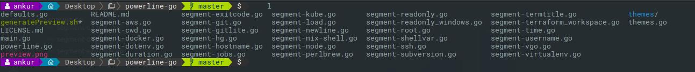
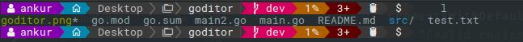
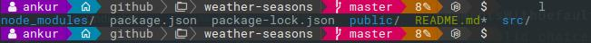

## 21st Century Powerline

Based on the Fork of [powerline-go](https://github.com/justjanne/powerline-go). This is still a work in progress.

Current default demo

## Language support extended

1. `Go`
   
2. `Node.js`
   

Currently this repo can be installed using `go get -u github.com/ankur-anand/C21-powerline`

For this extended version to work please install [nerdsfonts](https://nerdfonts.com/) and make sure the installed patched font is your default font for your terminal.

## Licence and Setup see [powerline-go](https://github.com/justjanne/powerline-go)

Make sure to replace `powerline-go` with `C21-powerline` for this installation to work.
